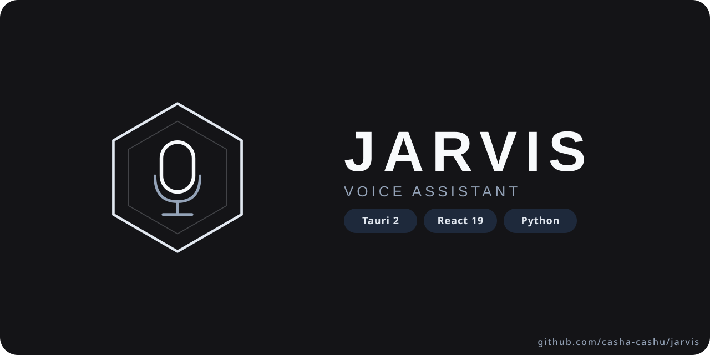

# JARVIS — голосовой ассистент

Голосовой ИИ-ассистент для Linux и macOS. Распознаёт речь (Vosk / Whisper), выполняет системные команды, отвечает через LLM (локально или через API), синтезирует речь (Piper TTS). При подключённом локальном Ollama умеет автономно выполнять задачи через bash/read/write tools с approval gate.

## Возможности

- **Распознавание речи** — Vosk (быстрый, офлайн) или faster-whisper (точный)
- **Синтез речи** — Piper TTS (русский голос Дмитрия), gTTS fallback
- **LLM интеграция** — Ollama (локально, с tool-use), OpenAI (нативный API, с tool-use), Anthropic Claude (нативный API, с tool-use), OpenRouter (агрегатор, чат)
- **NLU-классификатор** — TF-IDF + LogisticRegression intent classifier (кэшируется через joblib). Маршрутизирует русские фразы в команды по intent+slots, fallback на fuzzy-match
- **Bash-агент** — LLM (Ollama) может вызывать bash/read/write tools через нативный Ollama tool-calling API. Трёхслойный approval gate: hardline blocklist (`rm -rf /`, `mkfs`, `dd of=/dev/`, fork bombs, ...) → dangerous-pattern детектор (~20 паттернов: `curl|sh`, `git push -f`, `iptables -F`, ...) → approval gate (`auto` / `strict` / `yolo`)
- **Управление системой** — воркспейсы, окна, скриншоты, звук, блокировка
- **Кроссплатформенность** — автоопределение DE/WM (Hyprland, KDE, GNOME, i3, Sway, macOS)
- **Multi-turn диалоги** — 10с таймаут на follow-up, mute/unmute голосом
- **Напоминания** — «напомни через 10 минут», «таймер на 5 минут»
- **Диктовка** — голосовой ввод текста через wtype/xdotool
- **Wake word** — «джарвис» + альтернативы
- **Persistence LLM-истории** — диалог сохраняется в `~/.local/share/jarvis/history.json`, переключение провайдера не теряет контекст
- **Стриминг ответов** — токены появляются по мере генерации; видно каждую выполняемую команду и её вывод
- **Изоляция контекста** — каждый чат держит свою память LLM, диалоги не смешиваются

## JARVIS UI (GUI)

Десктопный интерфейс на Tauri 2 + React 19 в каталоге `jarvis-ui/`:

- Тёмная/светлая тема, кастомный тайтлбар
- Чаты с сохранением истории, стриминг ответов, траектория агента (команда → вывод)
- Провайдеры моделей: добавьте endpoint+ключ один раз — модели всех провайдеров подгружаются и группируются в одном селекторе
- Выбор микрофона (PulseAudio/PipeWire), системные статусы, напоминания

```bash
cd jarvis-ui
npm install
npm run tauri dev   # или npm run dev для браузерного режима
```

## Поддерживаемые платформы

| OS | DE/WM | Статус |
|---|---|---|
| Linux (Arch) | Hyprland | ✅ |
| Linux (Arch/Debian/Fedora) | KDE Plasma | ✅ |
| Linux (Arch/Debian/Fedora) | GNOME | ✅ |
| Linux (Arch/Debian/Fedora) | i3 | ✅ |
| Linux (Arch/Debian/Fedora) | Sway | ✅ |
| macOS | macOS | ✅ |

## Быстрый старт

### Пакеты (рекомендуется) — v2.6.2

Скачайте из [Releases](https://github.com/casha-cashu/jarvis/releases/tag/v2.6.2):

```bash
# Debian/Ubuntu
sudo apt install ./JARVIS_0.2.2_amd64.deb
jarvis   # /usr/bin/jarvis + /usr/bin/jarvis-bridge

# Fedora
sudo dnf install ./JARVIS-0.2.2-1.x86_64.rpm

# Arch/CachyOS
sudo pacman -U ./jarvis-0.2.2-1-x86_64.pkg.tar.zst

# Универсально (любой дистр)
chmod +x JARVIS_0.2.2_amd64.AppImage && ./JARVIS_0.2.2_amd64.AppImage
```

GUI — `jarvis` в меню, конфиг сидится в `~/.config/jarvis/config.yaml` (из `config.example.yaml`).

### Из исходников

```bash
# Клонирование
git clone https://github.com/casha-cashu/jarvis.git
cd jarvis

# Установка: системные пакеты + venv + python-зависимости + config.yaml
# (автоопределит Arch/Debian/Fedora/macOS)
bash install.sh

# Запуск
source venv/bin/activate
jarvis run
```

Скажите «джарвис» и дайте команду. Модели (Vosk, Piper-голос) ставятся
интерактивно через `jarvis setup`.

## Установка вручную

### Системные зависимости

**Arch Linux:**
```bash
sudo pacman -S python python-pip portaudio wtype xdotool
yay -S piper-tts  # из AUR
```

**Debian/Ubuntu:**
```bash
sudo apt install python3 python3-pip portaudio19-dev libnotify-bin xdotool wtype espeak-ng
```

**Fedora:**
```bash
sudo dnf install python3 python3-pip portaudio-devel libnotify xdotool wtype espeak-ng
```

**macOS:**
```bash
brew install python portaudio
```

### Python зависимости

```bash
git clone https://github.com/casha-cashu/jarvis.git
cd jarvis

python -m venv venv
source venv/bin/activate
pip install -e .
```

Или вручную:
```bash
pip install pyyaml vosk pyaudio numpy torch faster-whisper silero-vad scikit-learn joblib anthropic openai requests gtts pydantic rapidfuzz "audioop-lts>=0.2; python_version>='3.13'"
```

> **Важно:** `torch` нужен для Silero VAD. Если у вас NVIDIA GPU — поставьте CUDA-версию: `pip install torch --index-url https://download.pytorch.org/whl/cu118`

### Модели

- **Vosk**: запустите мастер `jarvis setup` (скачает модель) или укажите `model_path` в config.yaml
- **faster-whisper**: скачивается автоматически при первом запуске. Для офлайн-использования укажите `model_path` в `config.yaml` (см. ниже)
- **Piper TTS**: `yay -S piper-tts` (Arch) или бинарник с [GitHub](https://github.com/rhasspy/piper/releases)

## Конфигурация

Скопируйте пример и отредактируйте под себя:

```bash
cp config.example.yaml config.yaml
```

Основное:

- **Микрофон**: укажите `device_name` вашего микрофона (список устройств выводится при запуске)
- **STT**: выберите `vosk` (быстрый) или `whisper` (точный)
- **LLM**: укажите провайдер (`ollama`, `openai`, `anthropic`, `openrouter`)
- **TTS**: настройте пути к Piper бинарнику и модели

## Использование

```bash
# Полный список команд
jarvis --help

# Запуск с интерактивным выбором провайдера
jarvis run

# Запуск с конкретным провайдером
jarvis run -p ollama

# Запуск с пресетом
jarvis run --preset prod

# Режим без wake word
jarvis run --mode continuous

# Режим диктовки
jarvis dictation

# Управление пресетами
jarvis presets

# Тест модулей
jarvis test

# Диагностика окружения (конфиг, аудио, модели, LLM)
jarvis doctor

# Systemd автозапуск (только Linux)
jarvis service install
```

## Примеры команд

| Голосовая команда | Действие |
|---|---|
| «первый воркспейс» / «воркспейс 3» | Переключение рабочего стола |
| «следующий воркспейс» | Следующий рабочий стол |
| «закрой окно» | Закрыть активное окно |
| «полный экран» | Развернуть на весь экран |
| «скриншот экрана» | Скриншот всего экрана |
| «громче» / «тише» | Регулировка громкости |
| «заблокируй экран» | Блокировка |
| «открой браузер» / «открой телеграм» | Запуск приложений |
| «какое время» / «какая дата» | Текущее время/дата |
| «диктовка» | Режим голосового ввода |
| «напомни через 10 минут» | Установка напоминания |

Всё, что не распознано как команда — отправляется в LLM.

## Как это работает

1. **Автоопределение платформы** — при запуске определяется ОС, дистрибутив и DE/WM
2. **Загрузка адаптера** — выбирается соответствующий адаптер (Hyprland, KDE, GNOME, etc.)
3. **Генерация команд** — команды генерируются динамически под текущую платформу
4. **Распознавание речи** — Vosk/Whisper слушает wake word и команды
5. **Pipeline обработки**: exact → fuzzy → pattern (открой {app}) → standalone app → voice cmd → LLM
6. **Озвучка** — Piper TTS озвучивает ответ
7. **Multi-turn** — после ответа 10с ожидание follow-up (прерывается wake word)

## Лицензия

MIT

## Благодарности

- [Vosk](https://alphacephei.com/vosk/) — Speech recognition
- [faster-whisper](https://github.com/SYSTRAN/faster-whisper) — Speech recognition
- [Piper](https://github.com/rhasspy/piper) — Text-to-speech
- [Silero VAD](https://github.com/snakers4/silero-vad) — Voice Activity Detection
- [Ollama](https://ollama.ai/) — Local LLM
